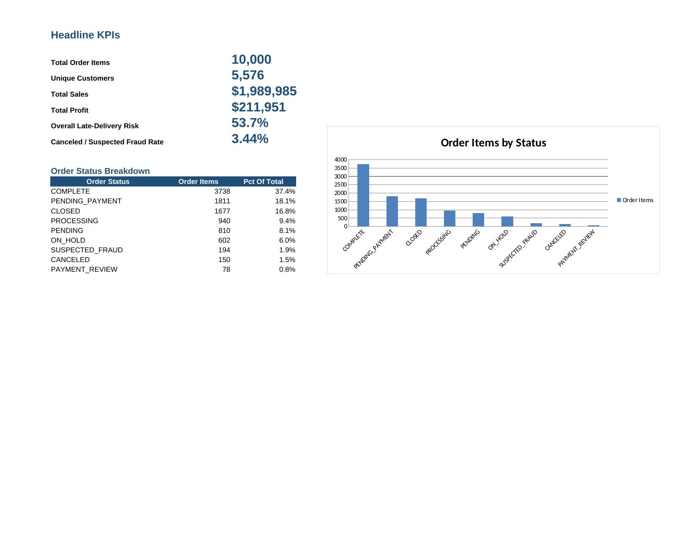
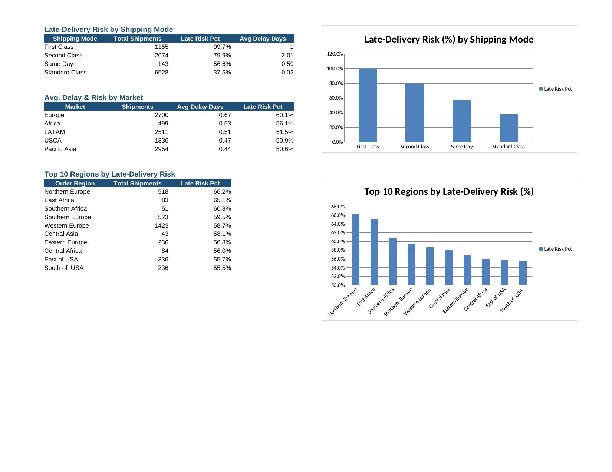
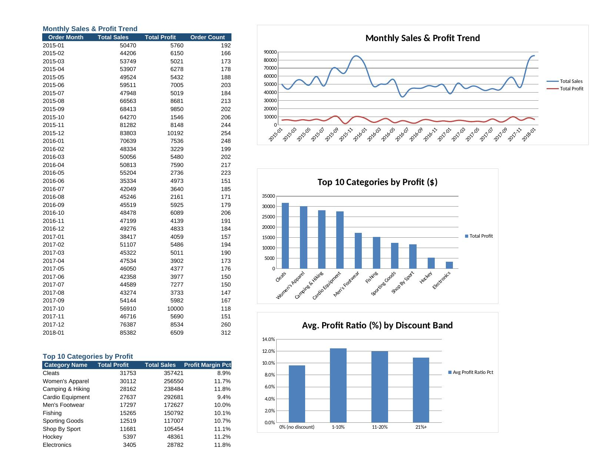

# Supply Chain Analytics — DataCo Dataset

End-to-end analysis of a real supply chain dataset: ETL (Python) → SQL business
queries (SQLite) → dashboard (Excel, Power BI-ready).

Built as a portfolio project for Data Analyst / MIS / Supply Chain & Logistics
Operations roles.

## Why this project

Distribution and logistics roles ask the same operational questions on repeat:
which shipping mode is unreliable, which regions/products drive profit, is
discounting helping or hurting margin, and how much of the order book is
stuck in exceptions (cancellations, fraud holds). This project answers all of
those, end to end, on a real (not simulated) dataset.

## Dataset

- **Source**: DataCo Smart Supply Chain Dataset (Constante, Silva & Pereira,
  2019), a widely-used public dataset for supply chain analytics.
- **This repo uses a 10,000-row sample** of the full 180,519-row dataset —
  same 53-column schema, same real-world messiness (nulls, duplicate keys,
  mixed granularity), sized to be practical to clone, review, and run without
  a data-download step.
- **Grain**: one row per order line item.
- **Date range**: Jan 2015 – Jan 2018.

**Data privacy note**: the raw file includes customer email, plaintext
password, first/last name, and street address columns. These are dropped in
the ETL step (`python/etl_pipeline.py`) before any analysis or publishing —
`customer_id` is retained so segment/RFM-style analysis still works without
exposing PII. This is a deliberate data-handling decision, not an oversight.

## Project structure

```
supply-chain-analytics/
├── data/
│   ├── raw/DataCoSupplyChainDataset.csv   # original 10K-row sample
│   ├── cleaned_supply_chain.csv           # ETL output
│   └── supply_chain.db                    # SQLite DB used by the SQL layer
├── python/
│   └── etl_pipeline.py                    # cleaning, de-identification, feature engineering
├── sql/
│   ├── 01_schema.sql                      # table structure & column reference
│   └── 02_business_queries.sql            # 10 business-question queries
├── dashboard/
│   └── Supply_Chain_Dashboard.xlsx        # KPI Summary / Delivery & Risk / Sales & Profit
└── docs/
    └── key_findings.md                    # written summary of results
```

## How to run it

```bash
# 1. Clone and install dependencies
pip install -r requirements.txt

# 2. Run the ETL pipeline (raw CSV -> cleaned CSV + SQLite DB)
python python/etl_pipeline.py

# 3. Run the business questions
sqlite3 data/supply_chain.db < sql/02_business_queries.sql

# 4. Open dashboard/Supply_Chain_Dashboard.xlsx for the visual summary
```

## Key findings

- **First Class shipping has the worst late-delivery risk (99.7%)** despite
  being a paid upgrade over Standard Class (37.5% late risk) — the shipping
  tier that costs more is the least reliable one in this dataset.
- **Cleats, Women's Apparel, and Camping & Hiking** are the top three
  profit-driving categories; **Books and CDs are loss-making** in this
  sample and are candidates for a range review.
- **Discounting above 20% correlates with the lowest average profit ratio
  (10.9%)**; the 1–10% discount band actually shows the highest margin
  (12.5%) — current deep-discount practice may be working against margin.
- **3.44% of order items are CANCELED or SUSPECTED_FRAUD** — a small but
  consistent share worth a dedicated review workflow.
- Northern Europe, East Africa, and Southern Africa carry the **highest
  regional late-delivery risk** (60–66%), useful for prioritizing carrier or
  route-level interventions.

Full query-by-query results are in `docs/key_findings.md`.

## Dashboard preview

**KPI Summary**


**Delivery & Risk**


**Sales & Profit**


## Tech stack

| Layer | Tool |
|---|---|
| Ingestion & cleaning | Python (pandas) |
| Analysis | SQL (SQLite) |
| Dashboard | Excel (openpyxl-built, pivot-ready source tables included) |
| Optional | Power BI — see `docs/key_findings.md` for the steps to load `data/cleaned_supply_chain.csv` into a Power BI dashboard |

## Possible extensions

- Add a late-delivery-risk prediction model (logistic regression / decision
  tree) using `shipping_mode`, `order_region`, `category_name`, and
  `days_for_shipment_scheduled` as features.
- Re-run against the full 180K-row dataset for higher-confidence regional
  breakdowns (smaller regions here have low sample sizes).
- Add a Power BI `.pbix` file with interactive cross-filtering once built in
  Power BI Desktop.

## Source citation

Constante, F., Silva, F., & Pereira, A. (2019). *DataCo Smart Supply Chain
for Big Data Analysis.* Mendeley Data, V5. DOI: 10.17632/8gx2fvg2k6.5

## License

This project is licensed under the MIT License.
See the [LICENSE](LICENSE) file for details.